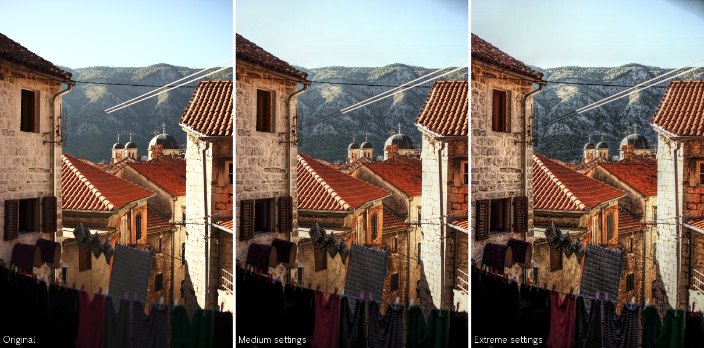

# Edge-aware Tone Mapping Filter for GIMP
Version 1.0 - First version

## Overview
The effect of processing a photo using an [HDR tone mapper](https://en.wikipedia.org/wiki/Tone_mapping) can lead to very impressive results. This is a tone mapping filter for GIMP that can be used for changing the visibility of details and the overall contract of an image. Sometimes, tone mapping can produce a "halo" effect in high-contrast areas--e.g. around the border between a dark foreground object and a bright sky behind it. This filter is aiming at eliminating such halos.

Is is inspired heavily by the technique described in the article ["Local Laplacian Filters: Edge-aware Image Processing with a Laplacian Pyramid"](http://people.csail.mit.edu/sparis/publi/2011/siggraph/).

## Where to find it in GIMP
The filter will appear as a single menu item: `Filters` > `Enhance` > `Edge-aware Tone Mapping`.

## Usage

The filter will work with the layer that is currently active. It has six options:

- `Mode`  
  The filter performs a lot of computations and will run for longer time than an average GIMP filter. Therefore, I have included these three modes:
  - `Preview/evaluate settings`  
    This mode is for experimenting with filter settings and previewing the results. The filter will run (relatively) fast but produce results with a [posterisation-like look](https://en.wikipedia.org/wiki/Posterization).
  - `Image with low contrast`  
    In this mode the filter will run roughly 33% faster compared to the third mode but it should only by used with low-contrast images (images without any dark or bright areas).
  - `Image with normal contrast`  
    This mode can be used for all images but is the mode that runs for the longest time.

- `Noise Reduction`  
  Try increasing this setting if you experience that noise or compression artifacts in the image become too visible.

- `Detail/Edge Threshold`  
  The filter measures the mutual contrasts between pixels in the image and divides these contrasts into two categories; details and edges. This setting is a threshold that separates the two categories. When the amount of contract is less than this threshold the filter will categorize it as a detail, e.g. it could part of the texture on a surface. Contrasts greater than the threshold are categorized as edges that contribute to the overall contrast of the image, e.g. the difference between dark and bright areas. With a lower detail/edge threshold, fewer contrasts to be categorized as details and vice versa.

- `Details (Smooth <-> Enhance)`  
  This setting, which can be either negative or a positive describes the amount of change the filter should apply to contrasts that were categorized as details. A negative value will decrease those contrasts so the corresponding details will appear more smooth. A positive value will increase the contrasts so the details become more visible.

- `Edges (Compress <-> Expand)`  
  This setting applies to contrasts that were categorized as edges and it works the same way as for details. A negative value will decrease the overall contrast of the image and a positive value will increase it.

- `Keep Adjustment as Separate Layer`  
  If this is checked the result of the filter will be kept as a separate layer. It can be useful if the effect of the filter does not suit some areas of the image. A layer mask can be added afterwards to remove the effect from those areas.

To get the effect of an HDR tone mapper set the `Details` setting to a positive value and the `Edges` setting to a negative value to compress the overall contrast and enhance the details. Below are examples of such settings.

